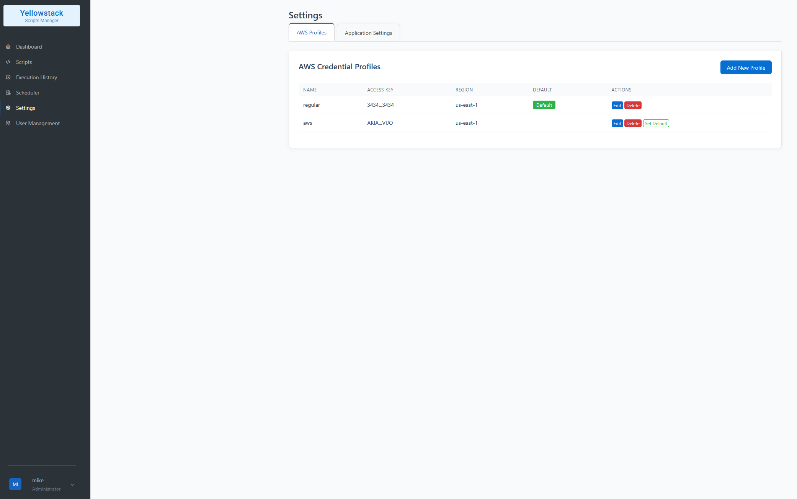
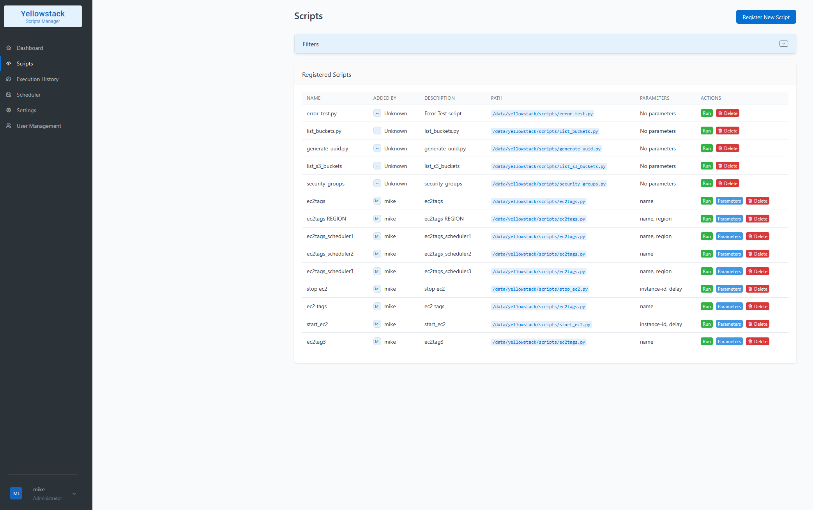
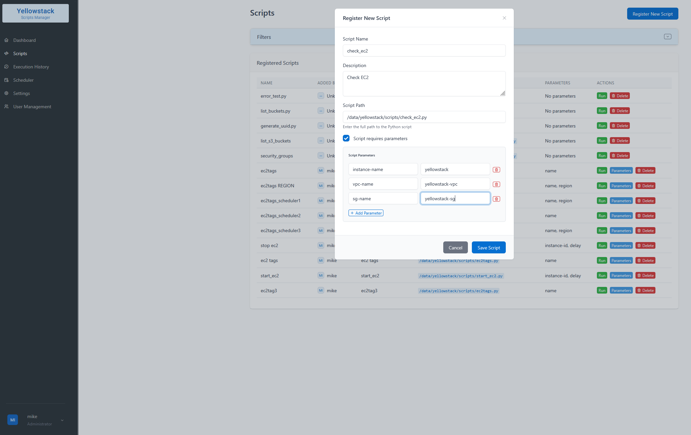
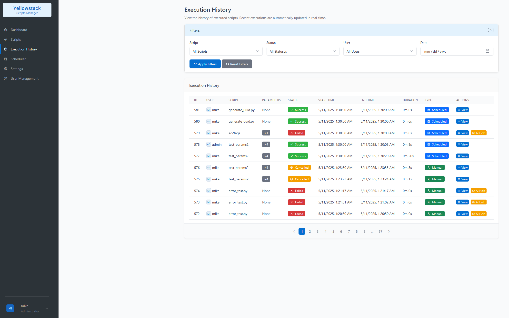

# YellowStack – Real-Time Script Execution for Humans


> Tired of juggling cron jobs, broken scripts, SSH sessions, and scattered logs?  
> YellowStack helps you run, schedule, and monitor Python scripts like a pro — in real time, with a modern UI and a dash of AI.

YellowStack is a Python-based platform built for DevOps, SREs, and infrastructure-minded developers who need more than `nohup` and hope.  
It makes automation **visible**, **trackable**, and — dare we say — kinda enjoyable.

🔧 Execute and schedule Python scripts  
📊 Track outputs and errors in real time  
🧠 Let OpenAI explain what broke (and how to fix it)  
☁️ Manage AWS credentials for automation  
🔐 Secure by default with CSRF, login, and role control

Whether you're scripting AWS, scraping data, or automating chaos — YellowStack is the tool that meets you halfway between bash and bliss.

## 🚀 Features

- **Script Management**
  - Register Python scripts with parameters
  - Execute scripts manually or on schedule
  - View execution history with detailed outputs
  - Interactive script support with real-time output
  - Script execution cancellation

- **Scheduling**
  - Daily schedules (specific time of day)
  - Interval schedules (every 1, 2, 3, 4, 6, 8, 12, or 24 hours)
  - Enable/disable schedules on-demand
  - Persistent scheduling across application restarts

- **AWS Integration**
  - Manage AWS profiles (access key, secret key, region)
  - Select profiles when executing AWS-related scripts
  - Override AWS regions for specific executions
  - Sample AWS scripts (EC2 tags, S3 buckets, security groups)

- **User Management**
  - User authentication with username/password
  - Secure password handling with hashing
  - Admin user role with special privileges
  - User creation, deletion, and role management

- **Real-time Monitoring**
  - WebSocket-based real-time script output
  - Dashboard with execution history
  - Execution statistics and charts
  - Status tracking for all executions

- **AI-Assisted Error Analysis**
  - OpenAI integration for script error analysis
  - Intelligent suggestions for error resolution
  - Configurable AI assistance (can be enabled/disabled)
  - Uses OpenAI GPT-3.5 model by default
  - Requires your own OpenAI API key (generated at OpenAI website)

- **RESTful API**
  - Complete API for all platform operations
  - CSRF protection for enhanced security
  - Authentication required for API access


## 🖼️ Preview

### 🔧 Dashboard


### 🧾 AWS Profiles


### 🗂️ Scripts Management


### ➕ Script Registration


### 📜 Execution History



## 📋 Requirements

- Python 3.9 or newer
- SQLite (for data storage)
- Optional: AWS credentials for AWS-related functionality
- Optional: OpenAI API key for AI-assisted error analysis (generate your own at OpenAI website)
- Dependencies listed in `requirements.txt`

### Python Version Note

- If you're using Python 3.9, you'll need to update urllib3 in requirements.txt to version 1.26.x
- For best compatibility and performance, Python 3.10+ is recommended, with Python 3.12+ being optimal

## 📂 Project Structure

```text
├── app/                           # Core application package
│   ├── auth/                      # Login/auth decorators
│   ├── models/                    # ORM models (users, scripts, executions, etc.)
│   ├── routes/                    # API and Web UI endpoints
│   │   ├── *_api.py               # REST API routes
│   │   └── views.py               # Web views
│   ├── services/                  # Core business logic
│   │   ├── *_service.py           # High-level services
│   │   └── *_adapter.py           # Low-level data adapters
│   └── utils/                     # Helper modules
│       ├── ai_helper.py           # OpenAI integration
│       ├── db.py                  # SQLite session helpers
│       └── timezone_config.py     # Timezone conversions
├── instance/                      # Instance-specific config (e.g. secrets)
├── scripts/                       # Executable AWS-related scripts
│   ├── ec2tags.py
│   └── ...                        # Other automation scripts
├── static/                        # Static frontend assets
│   ├── css/
│   ├── js/
│   └── favicon.ico
├── templates/                     # Jinja2 HTML templates
│   ├── layout.html
│   ├── login.html
│   └── ...
├── tests/                         # Pytest test suite
│   ├── test_csrf_protection.py
│   └── ...
├── app.py                         # Main Flask entry point
├── wsgi.py                        # WSGI-compatible entry
└── yellowstack.db                 # Local SQLite database (dev only)
```

## ⚙️ Setup and Installation

```bash
# Clone the repository to your preferred directory
# Replace /path/to/your/directory with your preferred installation location
cd /path/to/your/directory
git clone https://github.com/cheesebanana/yellowstack.git

# Set owner permissions (replace username:group with your username and group)
sudo chown username:group /path/to/your/directory/yellowstack
cd yellowstack

# Make the setup script executable
chmod +x setup.sh

# Run the setup script
./setup.sh

# Create directory for logs (used by the app)
sudo mkdir -p /var/log/yellowstack
sudo chown username:group /var/log/yellowstack  # Replace username:group with your values

# Activate virtual environment
source venv/bin/activate

# Verify dependencies
python3 verify_packages.py

# Run the application
python3 app.py
```

### Example Installation (with specific values)

```bash
# Using /data directory and user 'mike'
cd /data
git clone https://github.com/cheesebanana/yellowstack.git

# Set owner permissions
sudo chown mike:mike /data/yellowstack
cd yellowstack

# Make the setup script executable
chmod +x setup.sh

# Run the setup script
./setup.sh

# Create directory for logs (used by the app)
sudo mkdir -p /var/log/yellowstack
sudo chown mike:mike /var/log/yellowstack

# Activate virtual environment
source venv/bin/activate

# Verify dependencies
python3 verify_packages.py

# Run the application
python3 app.py
```

Alternatively, for manual setup without the setup script:

```bash
# Clone the repository
cd /path/to/your/directory
git clone https://github.com/cheesebanana/yellowstack.git
cd yellowstack

# Create directory for logs (used by the app)
sudo mkdir -p /var/log/yellowstack
sudo chown mike:mike /var/log/yellowstack

# Set up virtual environment
python3 -m venv venv
source venv/bin/activate

# Install dependencies
pip install -r requirements.txt
```

Once the server is running, you can access it at:

- http://localhost:5000 (from the same machine)
- http://<your_ip_address>:5000 (from another device on the same network)

## 🔐 Default Login

To access the admin dashboard after starting the server, use the default credentials:

- **Username:** `admin`  
- **Password:** `admin`

> ⚠️ It is strongly recommended to change the default password in production environments.

## 🖥️ Usage

### AWS Integration

1. Add AWS profiles through the settings page
2. Select profiles when executing AWS-related scripts
3. Override AWS regions as needed for specific executions

### Script Registration

1. Place your Python scripts in the `scripts/` directory
2. Register scripts via the web interface (recommended) or API
3. Define parameters for your scripts as needed

### Execution

- Run scripts manually from the web interface
- Set up schedules for automated execution
- Monitor execution status and output in real-time

## 🧪 Testing

The project includes comprehensive tests:

```bash
# Run all tests
cd /path/to/your/directory
source venv/bin/activate
python3 -m pytest tests -v

# Run specific test categories
python3 -m pytest tests/test_csrf_api_protection.py -v

```

## 🛡️ Security

YellowStack implements several security features:

- CSRF protection on all form submissions and API endpoints
- Secure password handling with hashing and salting
- Protection against common web vulnerabilities

## 🔄 API Access

YellowStack provides a comprehensive RESTful API for internal automation, integrations, and advanced users who want full control over script execution workflows.

The API allows you to:

- Manage scripts and their parameters
- Trigger executions and view real-time output
- Schedule recurring jobs
- Handle user access and roles
- Configure AWS credentials and settings
- Analyze failures using OpenAI (if enabled)

### 🔐 Authentication

All API endpoints require authentication via a valid user session. CSRF protection is enforced for all state-changing operations.
Breaking changes, if introduced, will be reflected in the release changelog.

> ⚠️ **API Stability Notice**  
> This API is considered *internal-first*. While it is fully functional, we do not currently guarantee long-term backward compatibility.  
> Use in production systems at your own discretion.

### 📚 API Endpoint Groups

- `GET /api/scripts` — Script management  
- `POST /api/run_script` — Trigger script execution  
- `GET /api/execution_history` — View execution logs and stats  
- `POST /api/cancel_execution/<id>` — Cancel a running script  
- `GET /api/users` — User management  
- `GET /api/aws_profiles` — Manage AWS credentials  
- `GET /api/settings` — System configuration

## 🤖 AI Involvement

This project was primarily developed with the assistance of AI tools — approximately **90%** of the codebase was generated or significantly shaped using large language models, including Claude (Anthropic) and ChatGPT (OpenAI).

AI tools were used to assist with:
- Writing core services, API routes, models, and decorators  
- Generating test coverage for unit, integration, and edge cases  
- Structuring reusable utilities and database logic  
- Creating setup scripts and configuration scaffolding  
- Drafting and refining documentation (including this README)

Human responsibilities focused on:
- Designing the overall system architecture and project structure  
- Reviewing and validating all AI-generated code  
- Customizing logic for project-specific needs  
- Configuring infrastructure, testing, and deployment flows  
- Performing final QA, debugging, and reality-checking

This collaboration showcases how modern AI can accelerate development without compromising quality — when paired with thoughtful architectural design and careful human oversight.

## 🧪 Test Scripts

The following files in `/scripts/` are used for internal testing and are required for the test suite to run correctly:

- `error_test.py` – Simulates errors and outputs to `stderr`
- `test_params.py` – Accepts arguments and simulates parameterized runs

These are not meant for production use, but should be kept in place unless you're modifying the test suite.

## 📄 License

This project is licensed under the [MIT License](LICENSE).

## 🤝 Contributing

Contributions are welcome! Please feel free to submit a Pull Request.

1. Fork the repository
2. Create your feature branch (`git checkout -b feature/amazing-feature`)
3. Commit your changes (`git commit -m 'Add some amazing feature'`)
4. Push to the branch (`git push origin feature/amazing-feature`)
5. Open a Pull Request

---

📬 Contact: hello@cheesebanana.com  
Maintained by [@msnesar](https://github.com/msnesar)

Built to save developers from running scripts manually at 2 AM.